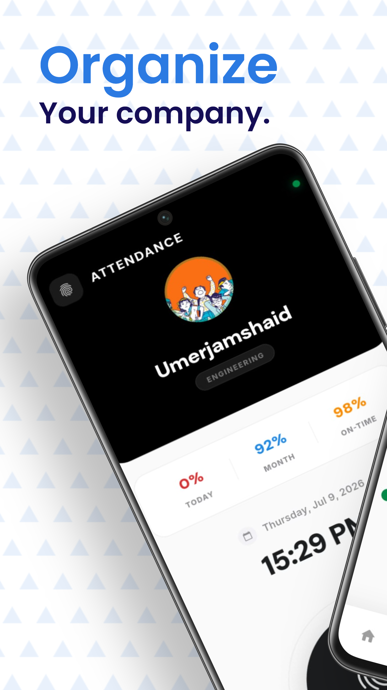
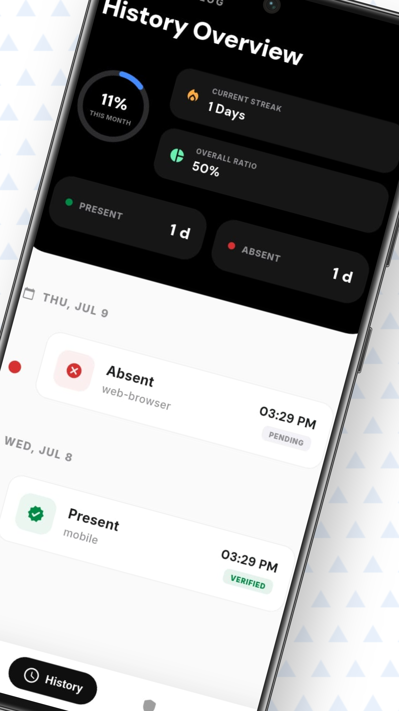
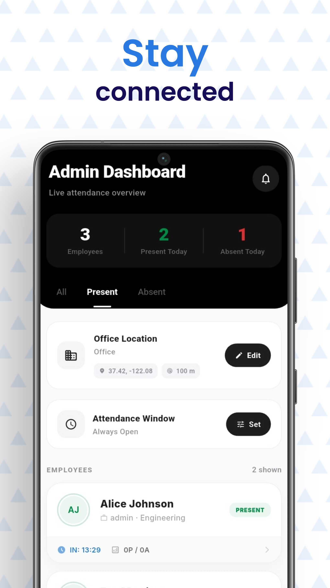
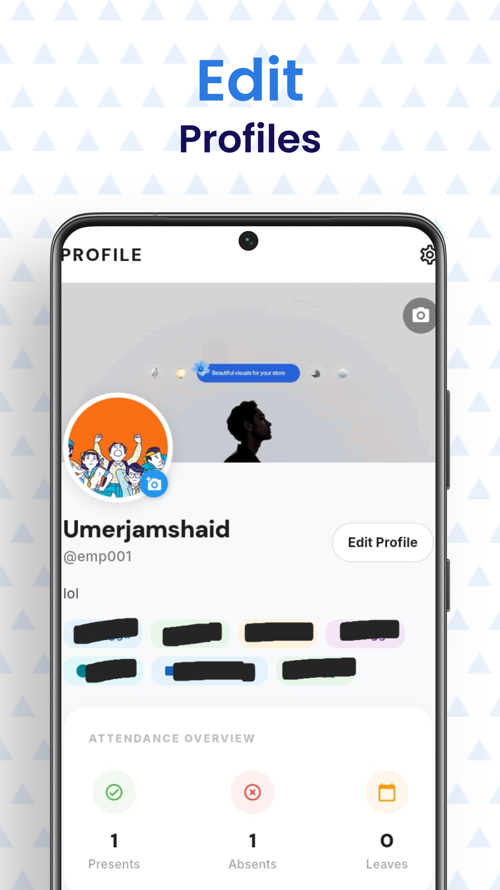
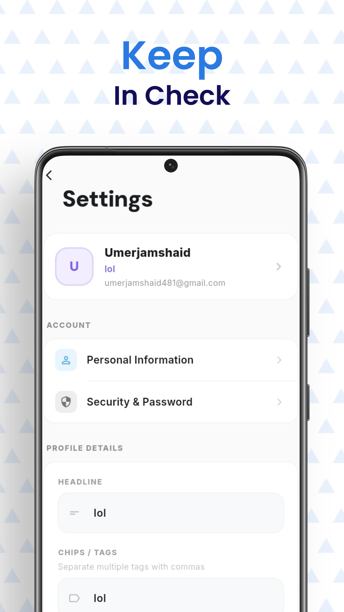
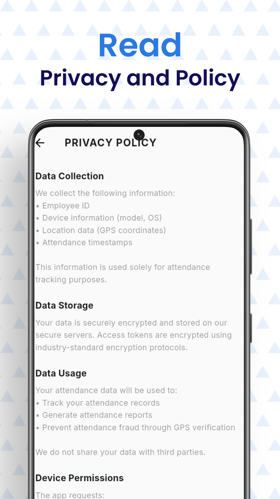

# P Attendance


A modern Flutter attendance app for teams that need location-aware check-ins, attendance history, admin visibility, profile management, and privacy-focused user flows.

This repository is prepared as a public portfolio version. Private organization-specific attendance submission code is intentionally excluded from the public build.

## Preview

<table>
  <tr>
    <td align="center"></td>
    <td align="center"></td>
    <td align="center"></td>
  </tr>
  <tr>
    <td align="center"><strong>Attendance</strong></td>
    <td align="center"><strong>History</strong></td>
    <td align="center"><strong>Admin</strong></td>
  </tr>
  <tr>
    <td align="center"></td>
    <td align="center"></td>
    <td align="center"></td>
  </tr>
  <tr>
    <td align="center"><strong>Profiles</strong></td>
    <td align="center"><strong>Settings</strong></td>
    <td align="center"><strong>Privacy</strong></td>
  </tr>
</table>

## What It Does

- Lets employees check in from a mobile-first attendance screen.
- Verifies location before attendance is accepted.
- Detects mocked locations and rejects low-quality GPS readings.
- Tracks attendance history with present, absent, pending, and verified states.
- Shows monthly attendance summaries, streaks, and attendance ratios.
- Includes an admin dashboard for employee attendance visibility.
- Allows office location and attendance window configuration.
- Provides profile, settings, and privacy policy screens.
- Keeps the public version safe by replacing private attendance submission with a stub.

## Tech Stack

| Area | Tools |
| --- | --- |
| App | Flutter, Dart |
| State management | Provider |
| Location | Geolocator |
| Permissions | permission_handler |
| Camera / image capture | image_picker |
| Local persistence | SharedPreferences |
| Networking | http |
| UI | Material Design, Google Fonts |

## Architecture

The project keeps app logic separated into focused layers:

```text
lib/
  app.dart                       App shell and routing root
  main.dart                      Public entrypoint
  bootstrap.dart                 Shared provider bootstrap
  providers/                     App state and business logic
  services/                      Device, location, storage, API services
  screens/                       Feature screens
  widgets/                       Reusable UI components
```

Attendance submission is abstracted behind `AttendanceSubmissionService`.

- Public build: uses `PublicAttendanceSubmissionService`, which disables private upload behavior safely.
- Private build: can wire a private implementation through `lib/main_private.dart`.

This keeps the GitHub version buildable without private backend code.

## Public vs Private Build

The default public entrypoint is:

```powershell
flutter run -t lib/main.dart
```

The private entrypoint is intentionally ignored by Git and can be used locally by the project owner:

```powershell
flutter run -t lib/main_private.dart
```

For the public repository, the private attendance submission file is not required and should not be committed.

## Getting Started

### Prerequisites

- Flutter SDK installed
- Android Studio or VS Code
- Android emulator, iOS simulator, or physical device

### Install

```powershell
flutter pub get
```

### Run

```powershell
flutter run
```

### Analyze

```powershell
flutter analyze
```

### Build Debug APK

```powershell
flutter build apk --debug
```

## Key Screens

**Attendance**

The attendance screen focuses on quick check-in, status visibility, upload availability, and daily attendance feedback.

**History**

Employees can review past attendance records with clear verification states and monthly summary metrics.

**Admin Dashboard**

Admins can monitor present and absent employees, review live attendance counts, and configure office attendance rules.

**Profile and Settings**

The profile flow includes user details, attendance overview, editable settings, and privacy information.

## Privacy Notes

The app is designed around attendance data, location checks, device metadata, and timestamps. The public version does not include private backend submission code or organization-specific secrets.

Before publishing any fork, review local files for private credentials, API keys, or organization-specific endpoints.

## Project Status

This is an active Flutter portfolio project built to demonstrate:

- practical mobile UI design,
- provider-based state management,
- location-aware workflows,
- clean public/private code separation,
- and maintainable Flutter project structure.

## Author

Built by Umer Jamshaid as a Flutter attendance management project.
